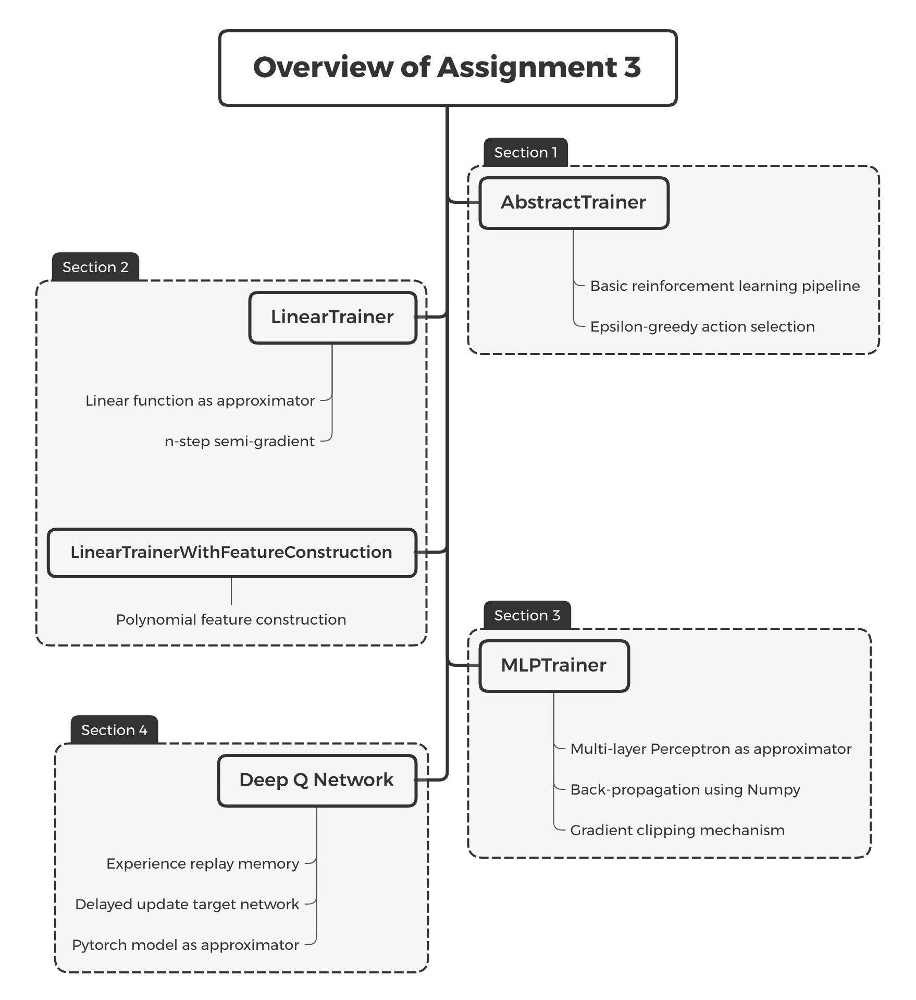

# IERG 5350 Assignment 3: Value Function Approximation in RL

**Due: 11:59 pm, October 28, 2020**

Welcome to the third assignment of this course! The objective of the Assignment 3 is to 

1. Implement serveral approximation techniques.
2. Understand the optimization process of n-step TD control.
3. Implement a simple neural network by Numpy.
4. Get familiar with Pytorch.

The following figure demonstrates the structure of assignment 3. In the first section of notebook, we build a basic RL pipeline. In the second section, we implement the linear function as approximator and also introduce feature construction technique. In the third section, we implement a simple neural network simply using Numpy package. In section 4, we use pytorch to build a nerual network as the approximator and implement the Deep Q Network. The following figure demonstrates the key points and the classes we will implement in each section.

## Step 1: Setup your environment

You need to prepare such packages:

1. Python 3
2. Jupyter Notebook
3. Gym
4. gym[atari], install via `pip install 'gym[atari]'`
5. Numpy
6. Pytorch, please refer to official website https://pytorch.org for installation guide

If you find anything confusing, feel free to open an issue at Github. We will response to you as soon as possible. If you get stuck by some strange errors, check the Github repo since it may be fixed by our latest commits.

## Step 2: Finish the notebook

We left many `[TODO]` in the notebook file. Following the instructions in the notebook and finish all `[TODO]`. 

Make sure your code can be run completely bug-free. Our staff will run the codes by `Restart & Run All` so make sure nothing stop the running.

## Step 3: Submit your work

Following the procedure to submit your work:

1. Before submitting, remember to fill your name and student ID into the table at the top of the file.
2. Run your codes in sequential manner, that is, run it by `Restart & Run All`. Remember to keep everything intact.
3. Generate the PDF file via `File / Download As / pdf ` to the `assignment1` directory.
4. Compress the all files in `assignment3` directory into a **zip** file.
5. Send the **zip file** and the **PDF file** to us as **two seperated files** via email: cuhkrlcourse@googlegroups.com with title in pattern `"2020fall-IERG5350-hw3-{name}-{id}".format(name="john", id="123456")` for instance: `2020fall-IERG5350-hw3-john-123456`.

------

*2020-2021 Term 1, IERG 5350: Reinforcement Learning. Department of Information Engineering, The Chinese University of Hong Kong. Course Instructor: Professor ZHOU Bolei. Assignment author: PENG Zhenghao, SUN Hao, ZHAN Xiaohang.*

